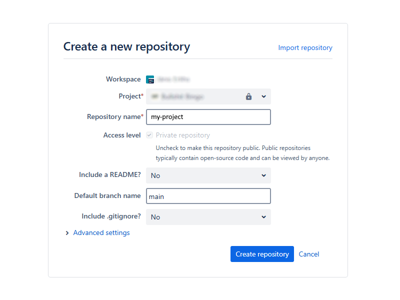

# Creating Project

1. Choose a project name, e.g., **my-project**

2. Create an empty repository on [Bitbucket](https://bitbucket.org/)



3. Create a local project folder in the VS Code terminal and clone the repository.

```ps
cd c:\
md projects
cd projects
git config core.autocrlf false
git config --global user.email "your@email.address"
git config --global user.name "Your Name"
git clone https://you@bitbucket.org/my-projects/my-project.git
cd my-project
```

4. Create a [README file](https://www.geeksforgeeks.org/what-is-readme-md-file/) in the project root directory (`./readme.md`)

_Preferably, change the end-of-line setting in VS Code to LF_

```md{5,9}
# my-project

## Overview

Write your text here

## Getting Started

Write your text here

## Credits

[wiki.bsbingo.me](https://wiki.bsbingo.me/)
```

7. Commit and push the README file changes to the Bitbucket repository

```ps
git add .
git commit -m "Initial commit"
git push
```

---

::: tip

Stage, commit, and push changes after each section.

[GIT Cheat Sheet](https://i.redd.it/8341g68g1v7y.png)

:::
