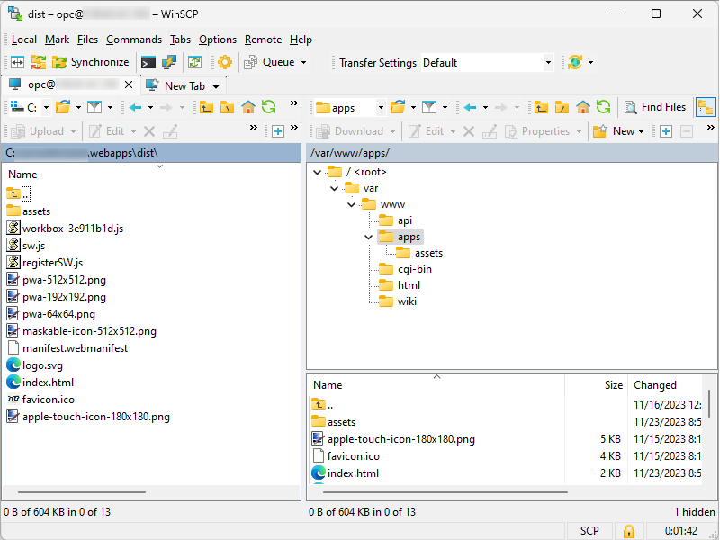
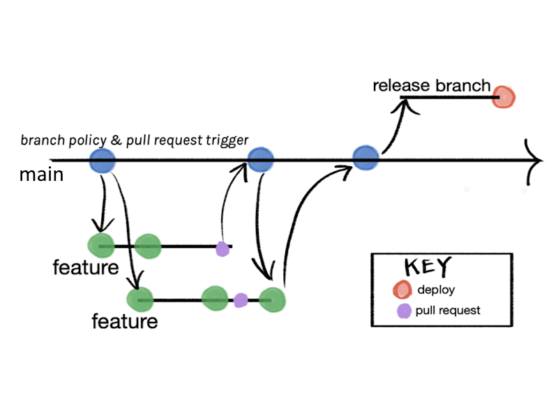

# Deploy

## Automatic version increment on build

To have automatically increment version, add `prebuild` script in `/package.json`

```json{8}
{
  "name": "webapps",
  "private": true,
  "version": "0.0.1",
  "type": "module",
  "scripts": {
    "dev": "vite",
    "prebuild": "npm --no-git-tag-version version patch",
    "build": "vue-tsc && vite build",
...
```

## Manual deployment

One option is to use [WinSCP](https://winscp.net/) and to copy manually files from `/webapps/dist` to web server's `/var/www/apps`



::: tip

Enable automated `sudo` on logging

:::


## Branching strategy

Git branching strategies are crucial for efficient team collaboration, version control, and software delivery. Here are some of the most common Git branching strategies:

1. **Feature Branch Workflow**:

   - Each new feature is developed in its own branch, which is created from the `develop` or `main` branch. This keeps the main codebase free from unstable code. Once the feature is complete, it is merged back into the main branch. This workflow is ideal for managing feature development in a controlled manner.

2. **Gitflow Workflow**:

   - A strict branching model designed for release management. It involves multiple branches: `feature`, `develop`, `release`, `hotfix`, and `main` (or `master`). `Feature` branches are used for new features, merged into `develop` for testing. When ready for release, they are merged into a `release` branch, then into `main` for production and back into `develop` to sync. `Hotfix` branches are used for quick fixes on the production code.

3. **Forking Workflow**:

   - Primarily used in open-source projects. Each developer forks the main repository, creating a personal copy. Developers push to their own repositories, and maintainers of the original repository merge these changes via pull requests. This strategy is excellent for projects with many contributors.

4. **Centralized Workflow**:

   - Similar to SVN, this strategy involves a single central branch (`main` or `master`). All changes are committed directly to this branch, and it is suitable for small teams or solo developers. However, it lacks the advantages of other branching strategies in terms of isolating different stages of development.

5. **Trunk-Based Development**:

   - Developers work on small changes that are merged back into a single branch called `trunk` or `main`, often multiple times a day. Long-lived branches are avoided. This approach is suited for continuous integration but requires a robust testing culture to maintain stability.

6. **Release Branch Workflow**:

   - When the development branch reaches a releasable state, a release branch is created. No new features are added after this point—only bug fixes, documentation generation, and other release-oriented tasks. Once it's stable, it's merged into `main` and tagged with a version number. It's ideal for managing releases systematically.

7. **Environment Branching**:
   - Used in conjunction with deployment pipelines. Branches like `develop`, `staging`, and `production` represent different stages of the deployment process. Code is promoted from one branch to another as it passes through stages of testing and deployment.

Each of these strategies has its advantages and best fits different development workflows and team sizes. The choice of a branching strategy should be based on the team's needs, the complexity of the project, and the desired release cycle.

For simplicity, we will use **Release Branch** strategy.



In order to release, merge code into release branch:

```ps
git checkout -b release
git merge main

git push --set-upstream origin release
```

## Bitbucket Pipelines

Deployment can be easily automated by using [Bitbucket Pipelines](https://bitbucket.org/product/features/pipelines).

### About Bitbucket pipelines

Bitbucket Pipelines is a continuous integration and delivery service integrated into Bitbucket, a web-based version control repository hosting service for projects that use Git or Mercurial. Here are the main features of Bitbucket Pipelines:

1. **Automated Builds and Tests**:

   - Pipelines automate the process of building and testing your code every time you commit changes, ensuring that new code integrations work as expected.

2. **Continuous Integration and Delivery (CI/CD)**:

   - It supports continuous integration and continuous delivery practices, allowing you to automatically deploy code to production servers or deliver it to your users.

3. **Configuration as Code**:

   - Pipelines are configured using a `bitbucket-pipelines.yml` file placed at the root of your repository. This file defines your pipelines and determines what happens when you push changes to your repository.

4. **Docker Support**:

   - Pipelines use Docker containers to provide a consistent, isolated environment for your builds. You can specify the Docker image you want to use, ensuring your build environment matches your production environment.

5. **Parallel Steps**:

   - It allows you to run multiple steps in parallel, which can reduce the time it takes for your pipeline to complete.

6. **Customizable Pipelines**:

   - You can create custom pipelines for different branches or custom scenarios (like deployment or testing), offering flexibility in how you handle different workflows.

7. **Environment Variables**:

   - Securely add, edit, and use environment variables in your pipeline. These can store sensitive information like API keys and passwords without exposing them in your repository.

8. **Integration with Third-Party Tools**:

   - Bitbucket Pipelines integrates with various third-party tools and services like JIRA, Slack, AWS, and more, allowing for seamless workflows.

9. **Caching Dependencies**:

   - Pipelines can cache dependencies to speed up future builds, saving time in downloading or installing packages that your build process requires.

10. **Deployment Capabilities**:

    - It supports automated deployments to various environments, allowing for a streamlined process from code commit to deployment.

11. **Manual Triggers**:

    - You can configure manual steps within your pipelines that require a trigger by a team member, which is useful for controlled deployments or other actions.

12. **Branch-specific Pipelines**:

    - You can create different pipelines for different branches, enabling you to apply specific processes for feature branches, hotfixes, releases, etc.

13. **Insightful Analytics and Reporting**:

    - Bitbucket Pipelines provides insights and reports on your build times and deployment status, helping you to monitor and optimize your CI/CD process.

14. **Access Control**:

    - You can manage permissions and access controls to ensure only authorized individuals can trigger or modify pipelines.

15. **Easy to Set Up and Use**:
    - Its integration with Bitbucket makes it straightforward to set up, with a user-friendly interface and clear documentation.

Bitbucket Pipelines is particularly beneficial for teams already using Bitbucket for source control, as it provides a seamless and integrated CI/CD solution without the need to use external services.

### Creating pipeline

Create pipeline file `/bitbucket-pipelines.yml`

```yaml
#  Build and deploy web application

image: node:16

pipelines:
  branches:
    release:
      - step:
          name: Build & deploy
          deployment: production
          script:
            - cd apps
            - npm install
            - npm run build
            - npm run docs:build
            - pipe: atlassian/ssh-run:0.2.4
              variables:
                SSH_USER: opc
                SERVER: xxx.xxx.xxx.xxx
                COMMAND: 'rm -rf /var/www/apps/*'
            - pipe: atlassian/scp-deploy:0.3.3
              variables:
                USER: opc
                SERVER: xxx.xxx.xxx.xxx
                REMOTE_PATH: '/var/www/apps'
                LOCAL_PATH: 'dist/*'
            - pipe: atlassian/ssh-run:0.2.4
              variables:
                SSH_USER: opc
                SERVER: xxx.xxx.xxx.xxx
                COMMAND: 'rm -rf /var/www/wiki/*'
            - pipe: atlassian/scp-deploy:0.3.3
              variables:
                USER: opc
                SERVER: xxx.xxx.xxx.xxx
                REMOTE_PATH: '/var/www/wiki'
                LOCAL_PATH: 'wiki/.vitepress/dist/*'
            - pipe: atlassian/ssh-run:0.2.4
              variables:
                SSH_USER: opc
                SERVER: xxx.xxx.xxx.xxx
                COMMAND: 'rm -rf /var/www/html/*'
            - pipe: atlassian/scp-deploy:0.3.3
              variables:
                USER: opc
                SERVER: xxx.xxx.xxx.xxx
                REMOTE_PATH: '/var/www/html'
                LOCAL_PATH: '../index.html'
```

In order for pipeline to run, go to Bitbucket repository settings and generate SSH key and add public key to authorized keys

```bash
nano ~/.ssh/authorized_keys
```

And add known host to pipeline.

For first run, directory structure must be set up and ownership of all files set to `opc` user with sufficient rights.
