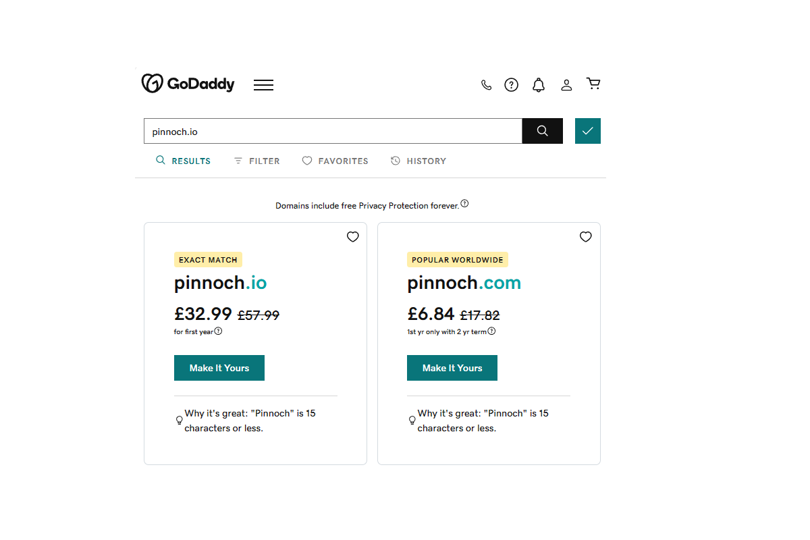

# Domain name

## Are all good domain names taken already?

No, not all good domain names are taken, but finding an available domain name that perfectly matches your desired criteria can be challenging, especially for popular and common terms. The availability of a domain name depends on several factors:

1. **Uniqueness**: The more unique and specific your desired domain name is, the higher the chances of finding an available one. If you're looking for a generic one-word domain, it's more likely to be taken.

2. **Top-Level Domain (TLD)**: There are numerous TLD options, like .com, .net, .org, .io, and many more. Consider using less common TLDs if your desired domain name with a .com extension is taken.

3. **Domain Name Generators**: Use domain name generators or brainstorm variations of your desired name. You might find a creative and available alternative.

4. **Expired Domains**: Explore expired domain lists or use domain marketplace websites to find domain names that were previously registered but are now available for purchase.

5. **Buy from Current Owners**: If you find a domain you really want but is currently owned by someone else, you can try to negotiate with the owner to purchase it. Be prepared to pay more for such domains.

6. **Longer Domain Names**: Sometimes adding extra words or characters can make a domain name available. However, be careful not to make it too long or confusing.

7. **Trademark and Legal Considerations**: Check for trademarks or legal issues associated with your desired domain name. You don't want to end up in a legal dispute.

8. **Creative Spelling**: Be cautious with this approach as it can make it difficult for people to remember or type your domain.

9. **Hyphenation**: You can consider using hyphens, but it's not always a user-friendly option.

Remember that your domain name is an important part of your online identity, so take your time to find a suitable one. While it may take some effort, it's not impossible to find a good domain name that fits your needs, even if your first choice is already taken.

## Get yourself a domain

1. Choose a Domain Registrar

A domain registrar is an accredited entity that manages the registration of internet domain names. It serves as an intermediary between domain owners and the domain registry, which maintains the official database of domain names and associated details.

Popular registrars include GoDaddy, Namecheap, and Google Domains. When selecting a registrar, consider pricing, support, additional services, and user experience. Confirm the registrar is accredited by the Internet Corporation for Assigned Names and Numbers (ICANN).

GoDaddy, a prominent registrar, will serve as the example in this tutorial. Sign up and create an account.

2. Search for available domain names

Tip: Consider adding a dot before the last two letters of a word to form a creative domain extension.

Once you find a suitable domain, finalize the registration to secure it.

Tip: purchasing for a longer period can come with a really good discounts.
