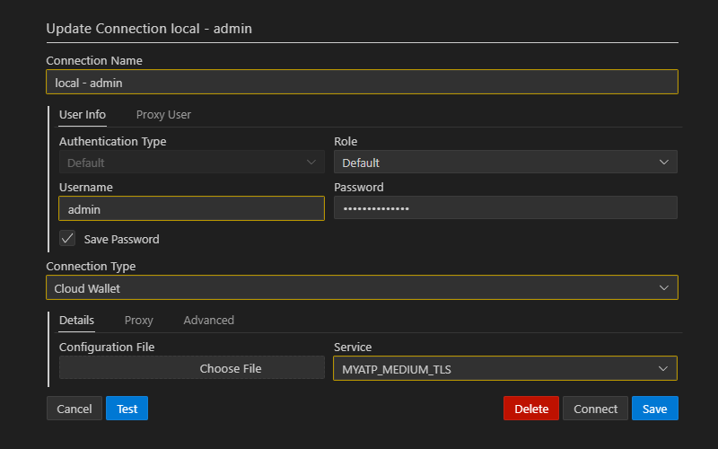

# Local DB Environment

Although development can be done fully in cloud infrastructure, depending on actual location, latency might become annoying.

The easiest way how to set up local backend environment with fully functional Oracle Database and Oracle Rest Data Services is to use containerization approach.

## Containerization

Containerization is a lightweight form of virtualization that allows applications to be packaged with their dependencies and run in isolated environments called containers. Containers share the host system's kernel but operate in separate user spaces, ensuring consistency across different environments.

### Docker vs Podman

Docker is a platform and tool for developing, shipping, and running applications inside containers. It provides a standard format for container images and a daemon for managing container lifecycles. Docker simplifies the process of application deployment by creating isolated environments for applications.

Podman (Pod Manager) is an open-source container management tool similar to Docker but designed to be daemonless. It runs containers as ordinary user processes, enhancing security by reducing the attack surface and allowing rootless operation.

@[youtube](Xx588nbshlM)

### Running on Windows

Both tools enable the execution of containerized applications on Windows, leveraging WSL 2 to provide a native-like Linux environment.

## Setting up environment

Below is how to set up environment on Windows.

### Install Podman

Install [Podman Desktop](https://podman-desktop.io/downloads/windows)

Follow instruction to install [Windows Subsystem for Linux](https://learn.microsoft.com/en-us/windows/wsl/install) and Podman itself.

### Download and run the container

1. Download container from [Oracle Container Registry](https://container-registry.oracle.com/)

Database --> adb-free

```ps
podman pull container-registry.oracle.com/database/adb-free:latest
```

2. Run the container

```ps
podman run -d -p 1521:1522 -p 1522:1522 -p 8443:8443 -p 27017:27017 -e WORKLOAD_TYPE=ATP -e WALLET_PASSWORD=01234567abcdeF -e ADMIN_PASSWORD=01234567abcdeF --cap-add SYS_ADMIN --device /dev/fuse --name adb-free container-registry.oracle.com/database/adb-free:latest-23ai
```

3. Wait for some time and check logs (click on container in Podman) as MYATP pluggable database is being loaded and mounted

```log
...
Total System Global Area 1608051720 bytes
Fixed Size                  5360648 bytes
Variable Size             721420287 bytes
Database Buffers          754974720 bytes
Redo Buffers                8855552 bytes
In-Memory Area                    1 bytes
Vector Memory Area        117440512 bytes
Database mounted.
Database opened.
```

### Start using the database

Copy wallet to local folder. Folder must be created as trying to copy to `C:\` will result in `Access denied`

```ps
podman cp adb-free:/u01/app/oracle/wallets/tls_wallet /source/tls_wallet
```

Zip all the contents off `tls_wallet` in `wallet.zip` and connect to your database using wallet



As a result there is a local Oracle Database fully compatible with the one in Oracle Cloud Infrastructure. It even has ORDS up and running at `https://localhost:8443/ords/`.
