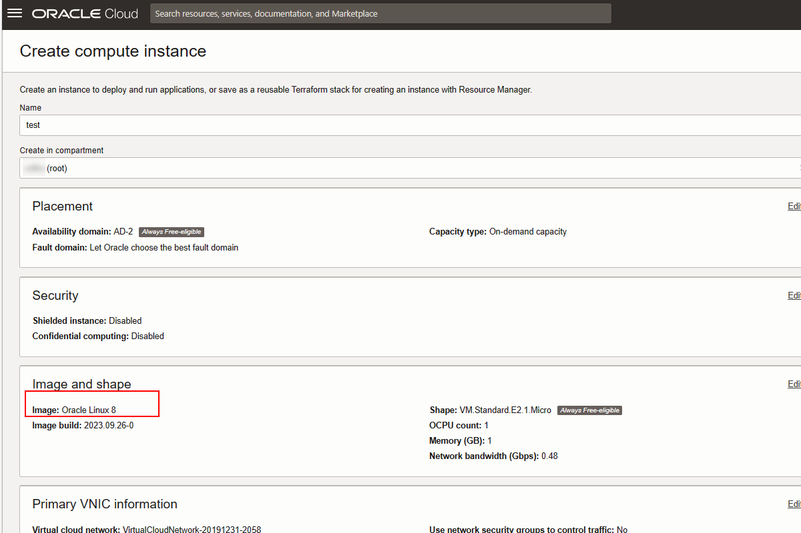
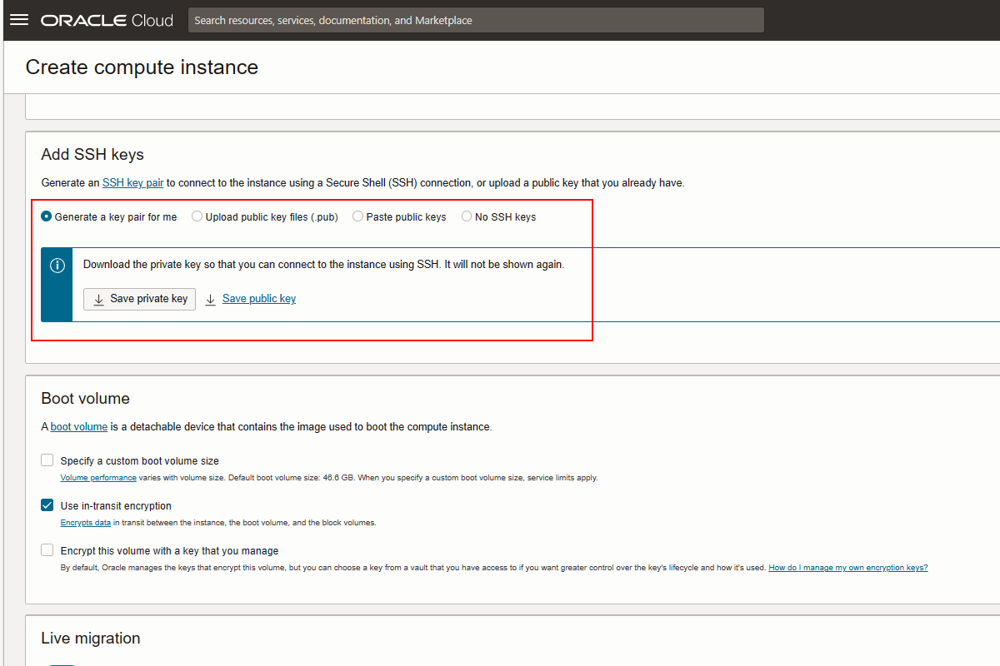
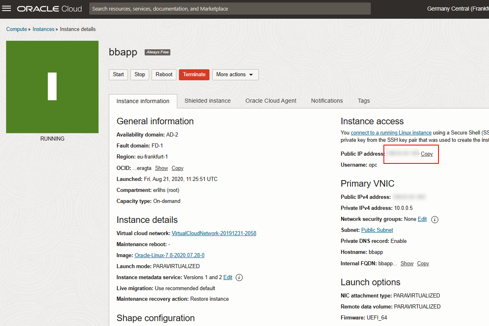
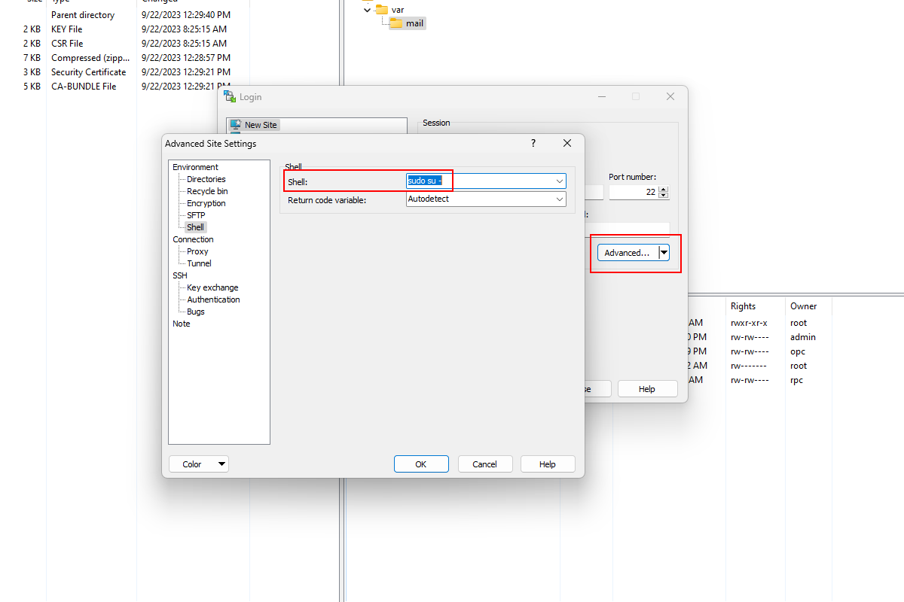
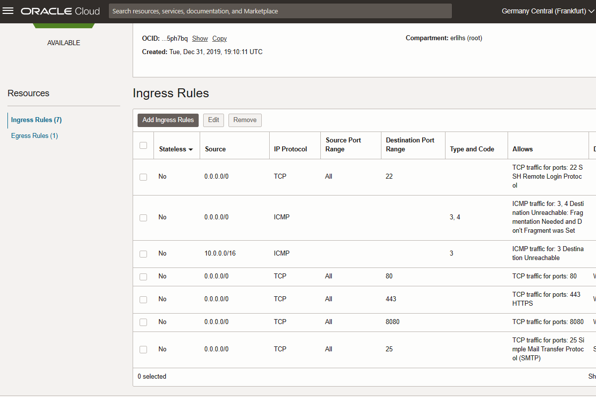

# Web server configuration

This is one of the most challenging parts, especially if never done before. We will host our web application in Oracle Cloud Infrastructure - Free Tier. Steps to be taken:

1. Create Linux server

2. Configure network access

3. Configure Apache2 Web server

4. Configure Postfix Email server

5. Obtain SSL Certificate

6. Configure the Apache server

## Create Linux server

1. Log in to Oracle Cloud and select **Create a VM Instance** from **Launch resources**

2. Choose name and **Linux 8** as image.



Before saving, download the keys as they will be used to access the instance.



3. Check server status

Go to dashboard and check the status of your instance as well as public IP address.



Also download [PuTTY](https://www.putty.org/) and [WinSCP](https://winscp.net/) and check if you can access the Linux server. The user is **opc**.

Hint - for WinSCP choose _Advanced_ and _sudo su -_ under shell.



## Configure network access

Go to _Networking_ -> _Virtual cloud networks_ -> _VirtualCloudNetwork-yyyymmdd-hhmi_ -> _Security List Details_ -> _Ingress Rules_

And allow ports 80, 443, 8080 and 25.



## Configure Apache2 web server

Two popular options exist when it comes to serving web applications. [Apache](https://httpd.apache.org/) and [NGinx](https://www.nginx.com/). To sum up, Apache provides flexibility and a wide range of modules, while NGINX offers scalability, speed, and multi functionality as a reverse proxy server. Regardless of your choice, both web servers support various software to provide a complete web stack for your development.

Installing Apache 2 on Oracle Linux 8 involves several steps. This guide assumes you have Oracle Linux 8 installed and you have administrative privileges. Here's a step-by-step guide:

### Step 1: Update Your System

First, update your system to ensure all existing packages are up to date.

1. Open a terminal.
2. Run the command:
   ```bash
   sudo dnf update
   ```

### Step 2: Install Apache (HTTPD)

Install Apache using the `dnf` package manager.

1. In your terminal, execute:
   ```bash
   sudo dnf install httpd
   ```

### Step 3: Start and Enable Apache Service

After installation, you need to start the Apache service and enable it to start on boot.

1. Start the Apache service:
   ```bash
   sudo systemctl start httpd
   ```
2. Enable Apache to start on boot:
   ```bash
   sudo systemctl enable httpd
   ```

### Step 4: Adjust Firewall Settings

If your server is protected by a firewall and you want to allow HTTP and HTTPS traffic, update the firewall settings.

1. Add HTTP and HTTPS services to the firewall:
   ```bash
   sudo firewall-cmd --permanent --add-service=http
   sudo firewall-cmd --permanent --add-service=https
   ```
2. Reload the firewall to apply changes:
   ```bash
   sudo firewall-cmd --reload
   ```

### Step 5: Verify Apache Installation

Check if Apache is installed and running.

1. Check the status of the Apache service:
   ```bash
   sudo systemctl status httpd
   ```
2. You can also verify Apache installation by accessing your server’s IP address in a web browser. You should see the default Apache welcome page.

## Configure Postfix e-mail server

Installing and configuring Postfix on Oracle Linux 8 requires careful steps to ensure a successful setup. Postfix is a popular open-source Mail Transfer Agent (MTA) used for routing and delivering email. Here’s a detailed guide:

### Step 1: Update Your System

Always start by updating your system to ensure all packages are up to date.

1. Open a terminal.
2. Run the update command:
   ```bash
   sudo dnf update
   ```

### Step 2: Install Postfix

Postfix is available in the default Oracle Linux repositories.

1. To install Postfix, execute:
   ```bash
   sudo dnf install postfix
   ```

### Step 3: Start and Enable Postfix Service

After installation, start the Postfix service and enable it to start on boot.

1. Start Postfix:
   ```bash
   sudo systemctl start postfix
   ```
2. Enable it to start on boot:
   ```bash
   sudo systemctl enable postfix
   ```

### Step 4: Configure Postfix

You’ll need to configure Postfix for your environment.

1. The main configuration file for Postfix is `/etc/postfix/main.cf`.
2. Open this file in a text editor:
   ```bash
   sudo vi /etc/postfix/main.cf
   ```
3. Make the necessary changes. Common settings include:
   - `myhostname`: The hostname of your mail server.
   - `mydomain`: The domain name of your mail server.
   - `myorigin`: Typically set to `$mydomain`.
   - `inet_interfaces`: Set to `all` to listen on all network interfaces.
   - `mydestination`: Domains for which this mail server should accept mail.
   - `relayhost`: (Optional) If you use an external service for sending emails.

Example:

```ini
queue_directory = /var/spool/postfix
command_directory = /usr/sbin
daemon_directory = /usr/libexec/postfix
data_directory = /var/lib/postfix
mail_owner = postfix

myhostname = mail.your.domain
mydomain = your.domain
myorigin = $mydomain
inet_interfaces = all
inet_protocols = ipv4
mydestination = $myhostname, localhost.$mydomain, $mydomain
unknown_local_recipient_reject_code = 550
mynetworks = 127.0.0.0/8, 192.168.1.0/24, 192.168.2.0/24

alias_maps = hash:/etc/aliases
alias_database = hash:/etc/aliases
mail_spool_directory = /var/spool/mail

smtp_tls_security_level = may
smtp_sasl_auth_enable = yes
smtp_sasl_password_maps = hash:/etc/postfix/sasl_passwd
smtp_sasl_security_options =
relayhost = smtp.email.eu-frankfurt-1.oci.oraclecloud.com
smtp_tls_security_level = encrypt

debug_peer_level = 2
debugger_command =
	 PATH=/bin:/usr/bin:/usr/local/bin:/usr/X11R6/bin
	 ddd $daemon_directory/$process_name $process_id & sleep 5
sendmail_path = /usr/sbin/sendmail.postfix
newaliases_path = /usr/bin/newaliases.postfix
mailq_path = /usr/bin/mailq.postfix
setgid_group = postdrop
html_directory = no
manpage_directory = /usr/share/man
sample_directory = /usr/share/doc/postfix-2.10.1/samples
readme_directory = /usr/share/doc/postfix-2.10.1/README_FILES
```

4. Save the file and exit the editor.

### Step 5: Configure Mailx (Optional)

Mailx is a simple mail user agent (MUA). Install and configure it to test sending emails.

1. Install Mailx:
   ```bash
   sudo dnf install mailx
   ```

### Step 6: Adjust Firewall Settings

If you have a firewall, allow SMTP traffic.

1. Open SMTP port (25) in the firewall:
   ```bash
   sudo firewall-cmd --permanent --add-service=smtp
   ```
2. Reload the firewall:
   ```bash
   sudo firewall-cmd --reload
   ```

### Step 7: Restart and Test Postfix

After configuration, restart Postfix and test it.

1. Restart Postfix:
   ```bash
   sudo systemctl restart postfix
   ```
2. Test sending an email using Mailx or another email client configured to use your Postfix server.

### Step 8: Secure Postfix (Recommended)

It’s important to secure your Postfix installation.

1. Consider using TLS encryption for sending emails.
2. Edit `/etc/postfix/main.cf` to configure security settings like TLS and SASL authentication.
3. Regularly update your system and Postfix to apply security patches.

### Conclusion

You now have Postfix installed and configured on Oracle Linux 8. Remember to regularly maintain and update your Postfix installation, and consider implementing additional security measures such as spam filtering and access controls. Postfix is highly customizable, so you may want to explore further configuration options based on your specific needs.

## Enable sending emails from Oracle Cloud.

Postfix on Linux will allow you to receive emails from, for example, SSL authorities. But outgoing emails from Oracle Cloud Infrastructure can be sent only via OCI SMTP gateway.

Oracle Cloud Infrastructure (OCI) Email Delivery is an email sending service and Simple Mail Transfer Protocol (SMTP) relay that provides a fast and reliable managed solution for sending both high volume bulk and transactional emails. Email Delivery provides the tools necessary to send application-generated email for mission-critical communications such as receipts, fraud detection alerts, multi-factor identity verification, and password resets. In this blog, I guide you through the process of sending emails with Email Delivery and give background on email best practices and authentication.

## Prerequisites

First, you need access to an OCI environment. If you don’t have one, you can easily create [your own trial](https://www.oracle.com/cloud/free/) with US$300 in free credits and access to our [Always Free](https://www.oracle.com/cloud/free/#always-free) services.

When you have an environment, ensure that your user has been assigned to a group with permissions to manage the email-family resources. Creating a user is security best practice instead of using your Console user that already has permissions assigned to it. If you need help, view the [Set Up Permissions](https://docs.oracle.com/en-us/iaas/Content/Email/Reference/gettingstarted.htm) section in the documentation to create a group and grant it the proper permissions.

Finally, you need a DNS domain to publish your domain keys identified mail (DKIM) and sender policy framework (SPF) records. While DKIM and SPF aren’t required to send emails, we highly recommend setting them up. We dive deeper into DKIM and SPF later.

## Sending email

### Generate SMTP credentials

SMTP credentials are necessary to send email through Email Delivery. Each user is limited to a maximum of two SMTP credentials. So, if you need more than two, create another user.

Log into the Oracle Cloud Console and navigate to **User Settings**.

  
_Figure 1: Navigating to user settings_

Scroll down to SMTP Credentials and click to generate one.

  
_Figure 2: Generating SMTP credentials​​​​​_

Copy the username and password. For security reasons, you can’t retrieve the password after closing the dialog box.

  
_Figure 3: Copying SMTP credential username and password_

### Create your email domain

An email domain lets you set up important authentication measures for sending email. Under Developer Services, select Application Integration and Email Delivery. Click **Email Domains** and create a domain. If setting up DKIM and SPF, choose a DNS domain that you own or control and plan to use for the sending email address.

  
_Figure 4: My email domain_

### Set up DKIM

DKIM is an email authentication technique that allows the receiver to verify the owner of an email domain. It gives the email a digital signature, which is a header field containing all the signature and key-fetching data. Email receivers, like Gmail and Microsoft, detect the DKIM signature and run a DNS query to search for the public key for that domain. If found, it decrypts the signature and confirms that it was created with the matching private key. So, implementing DKIM improves email deliverability and can protect your domain against malicious emails sent on behalf of your domain.

Now that you know what DKIM is, navigate to it in your zone and add one.

  
_Figure 5: Navigating to DKIM_

We use the DKIM selector for this DKIM key, which must be globally unique for your domain. We recommend using a regional indicator and date portion as part of the selector, such as prefix-region-YYYYMMDD, to help with future key rotation. Generate the DKIM record and then click **Create DKIM**.

  
_Figure 6: Creating DKIM record_

We now need to configure our DNS domain. Go to your zone and create the CNAME record with the value it gives you.

  
_Figure 7: Creating DKIM CNAME record_

If done correctly, your DKIM signing status changes to Active. Mine took a minute or so to propagate.

Depending on the update type, updates to your DNS records can take up to 24 hours to propagate globally.

  
_Figure 8: DKIM signing status_

Rotate your DKIM keys at least every six months. Rotation reduces the risk of active keys being compromised, either by attackers cracking or stealing them. For more information about rotating keys and DKIM in general, see [M3AAWG DKIM Key Rotation Best Common Practices](https://www.m3aawg.org/sites/default/files/m3aawg-dkim-key-rotation-bp-2019-03.pdf%22%20%5Cl%20%22:~:text=DKIM%20keys%20should%20be%20rotated,also%20standardize%20the%20rotation%20process.).

### Create an approved sender

You need an approved sender for all “From” addresses sending mail through OCI. Otherwise, mail is rejected. Every sender email address must be registered to use it for Email Delivery.

Note the following details about approved senders:

- An approved sender is associated with a compartment and only exists in the region where it was configured. If you create an approved sender in the US West (Phoenix) region, you can’t send email through the US East (Ashburn) region with that sender.
- Don’t create approved senders in the root compartment. If you do, you need to create a policy to manage approved senders in the entire tenancy. Creating approved senders in a compartment other than the root allows the policy to be specific to that compartment.
- Using multiple addresses in the email “From:” header is discouraged because it increases the possibility that your mail is placed in a spam folder or discarded. A best practice for the “From:” address is to match the header “From:” address when you submit mail to Email Delivery. If you use mismatched addresses, it reduces performance of your emails because both addresses need to be authorized as approved senders.
- Approved senders are unique to tenancies. If you create a duplicate sender, the service returns a 409 Conflict error.

Under DKIM, you can see Approved Senders. Create one.

  
_Figure 9: Creating approved sender_

### Configure SPF on your approved sender domain

SPF allows you to state which email servers are permitted to send email on behalf of your domain. Email receivers use SPF to detect email spoofing. You can implement it by publishing a special TXT record to your domain’s DNS records. The receiving mail server checks the SPF record of the sending domain to verify the email’s source IP address is authorized to send from that domain. Without SPF, a spam or phishing email can be spoofed to appear that it comes from a legitimate domain.

Navigate to your approved sender. Under the three-dot menu, select **View SPF**.

  
_Figure 10: Viewing SPF record values_

Choose your sending location and create a DNS TXT record with the corresponding value. I’m using Americas.

  
_Figure 11: Creating SPF TXT record_

It can take some time, but your domain now shows DKIM Signing and SPF working.

  
_Figure 12: DKIM and SPF working_

### Configure the SMTP connection

Navigate to Configuration to access SMTP sending information to configure the connection in your system.

  
_Figure 13: SMTP sending information_

The following information is displayed:

- Public endpoint: The public endpoint used to send email to this region
- SMTP ports: The SMTP ports used to accept email. Email Delivery supports TLS on port 25 or 587 (recommended).
- Security: Indicates if TLS is being used. Customers must encrypt email while in transit to Email Delivery.

## Obtain SSL certificate

Two options exist. Traditional SSL certificates that costs certain annual fee and Let's Encrypt as a free alternative.

The Let's Encrypt initiative makes creating and installing SSL certificates a simple task. They are also free, so you may ask yourself, “why would I ever pay for an SSL certificate from another provider?”

Although Let's Encrypt SSL certificates provide basic SSL encryption, they lack many of the benefits of certificates issued by established CA (certificate authority) SSL providers, including:

**Extended validity**: Let's Encrypt SSL certificates are only valid for 90 days and must be renewed frequently. By contrast, most traditional SSL certificates are valid for at least one year, with the option of longer validity periods (for example, three years).

**Warranty**: Let's Encrypt certificates do not include a warranty, whereas traditional SSL certificates usually do.

**Support**: Let's Encrypt SSL does not have staff available to assist with creating or installing SSL certificates. This can be an issue for professionals and business owners who must quickly get a site configured and working. For example, GlobalSign has a network of trained personnel who provide support through online ticketing, chat, and telephone.
Customer vetting: Let's Encrypt SSL uses basic domain-based vetting (the ACME protocol) to issue SSL certificates. Traditional CA providers use additional vetting procedures to help verify that customers actually are who they claim to be.

**SSL certificate options**: Let's Encrypt SSL only offers domain-validated certificates (DV). If you need the extra security of an extended validation certificate (EV) for your site, you must purchase one from a traditional CA provider. Additionally, Let's Encrypt SSL does not offer wildcard or multi-domain certificates.

Summing up, if your site has a business value, go for fully qualified SSL certificate, if it is for education or experimental purposes - Let's Encrypt can be used.

### Creating certificate request

1.  Connect via PuTTY to your server
2.  Type the following command at the prompt:

```bash
openssl req -new -newkey rsa:2048 -nodes -keyout yourdomain.key -out yourdomain.csr
```

3.  Next, include the following information into the CSR. Please, use only alphanumeric characters when entering your details

- **Country Name:** enter the [two-letter code](https://countrycode.org/) of your country. If you have a Business Validation or Extended Validation certificate, make sure the country you submit, is the official residence of your organization
- **State or Province Name:** type the full name of the state or region where your company is registered
- **Locality Name:** specify the name of the city or town where your business is located
- **Organization Name:** enter the officially registered name of your company. For instance, GPI Holding LLC. For Domain Validation certificates, you can put in **NA** instead
- **Organization Unit Name:** it’s usually **IT** or **Web** Administration. You can use **NA** for DV certificates
- **Common Name:** specify the Fully Qualified Domain Name (FQDN) to which you want to assign your SSL certificate. For example, ssldragon.com. If you want to activate a wildcard certificate, add an asterisk in front of your domain name (e.g. \*.ssldragon.com)
- **Email Address:** provide a valid email address

**_Note_**_: Next attributes are optional. If you don’t want to fill them in input a dot (.) to leave them blank._

- **A challenge password:** this is an obsolete attribute, no longer required by the Certificate Authorities. To avoid any confusion, leave this field blank
- **An Optional Company Name:** If your official company name seems too long or complex, you can enter a shorter name or your brand name here. Again, to avoid confusion, we recommend ignoring this field

4. The OpenSSL utility will instantly create two files:

- **key** containing your private key (you will need it later during SSL installation)
- **csr** incorporating your CSR code (you will need it when applying for your SSL certificate)

### Submit request to the certification authority

Open the **yourdomain.csr** file with a text editor of your choice, and copy-paste its content including the — BEGIN CERTIFICATE REQUEST — and footer — END CERTIFICATE REQUEST — tags during your order process with SSL certification authority.

It will email you verification link to *admin@your.domain* - that is reason why Postfix was needed.

After the Certificate Authority signs and sends you the SSL Certificate, you can safely install it on your Apache server.

### Let's encrypt

As an alternative - [Let's encrypt wildcard certificate can be used](https://www.linkedin.com/pulse/creating-wildcard-ssl-certificate-using/)

### Configure Apache server

Before starting, let's define the structure of the site. Our final setup will be:

- **https://your.domain** - static landing page
- **https://apps.your.domain** - single page progressive web application
- **https://wiki.your.domain** - statically generated documentation library

1.  Create corresponding directories for your web content

```
/var/www/html
/var/www/apps
/var/www/wiki
```

You can create a dummy `index.html` file in each folder to test the app.

2. Adjust Apache configuration file

`/etc/httpd/conf/httpd.conf`

```ini

ServerRoot "/etc/httpd"

Include conf.modules.d/*.conf

User apache
Group apache

ServerAdmin erlihs@gmail.com

#ServerName www.example.com:80

<Directory />
    AllowOverride none
    Require all denied
</Directory>

DocumentRoot "/var/www/html"

<Directory "/var/www/html">
    Options Indexes FollowSymLinks
    AllowOverride None
    Require all granted
</Directory>

<Directory "/var/www/wiki">
    Options Indexes FollowSymLinks
    AllowOverride None
    Require all granted
</Directory>

<IfModule dir_module>
    DirectoryIndex index.html
</IfModule>

<Files ".ht*">
    Require all denied
</Files>

ErrorLog "logs/error_log"

LogLevel warn

<IfModule log_config_module>
    LogFormat "%h %l %u %t \"%r\" %>s %b \"%{Referer}i\" \"%{User-Agent}i\"" combined
    LogFormat "%h %l %u %t \"%r\" %>s %b" common
    <IfModule logio_module>
      LogFormat "%h %l %u %t \"%r\" %>s %b \"%{Referer}i\" \"%{User-Agent}i\" %I %O" combinedio
    </IfModule>
    CustomLog "logs/access_log" combined
</IfModule>

<IfModule mime_module>
    TypesConfig /etc/mime.types
    AddType application/x-compress .Z
    AddType application/x-gzip .gz .tgz
    AddType text/html .shtml
    AddOutputFilter INCLUDES .shtml
</IfModule>

AddDefaultCharset UTF-8

<IfModule mime_magic_module>
    MIMEMagicFile conf/magic
</IfModule>

EnableSendfile on

Listen 80

NameVirtualHost *:80

<VirtualHost *:80>
    ServerName bsbingo.me
    redirect / https://bsbingo.me
</VirtualHost>

Listen 443

<VirtualHost *:443>
	ServerName bsbingo.me
	DocumentRoot /var/www/html
	SSLEngine On
	SSLCertificateFile /etc/httpd/ssl/bsbingo_me.crt
	SSLCertificateKeyFile /etc/httpd/ssl/server.key
	SSLCertificateChainFile /etc/httpd/ssl/bsbingo_me.ca-bundle
</VirtualHost>

<VirtualHost *:443>
	ServerName wiki.bsbingo.me
	DocumentRoot /var/www/wiki
    SSLEngine On
    SSLCACertificateFile /etc/letsencrypt/live/bsbingo.me/chain.pem
    SSLCertificateFile /etc/letsencrypt/live/wiki.bsbingo.me/cert.pem
    SSLCertificateKeyFile /etc/letsencrypt/live/wiki.bsbingo.me/privkey.pem
    Include /etc/letsencrypt/options-ssl-apache.conf
SSLCertificateChainFile /etc/letsencrypt/live/wiki.bsbingo.me/chain.pem
</VirtualHost>
```

## Test your deployment

If all is done correctly, all sites:

- https://your.domain
- https://apps.your.domain
- https://wiki.your.domain

can be opened and shows valid SSL in a browser.
