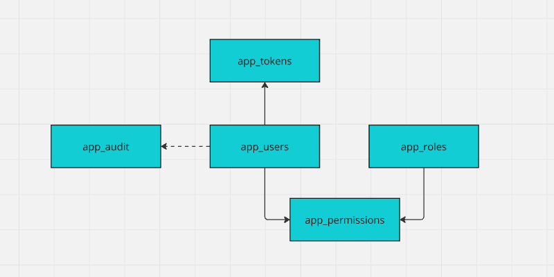

# Authorization

## Concepts

### Role-Based Authorization

A security mechanism that restricts access to resources or functionality based on a user's role within an application. It ensures users can only perform actions or view content permitted for their assigned roles.

### Navigation Guards

A feature in front-end frameworks that controls access to routes or pages based on conditions such as authentication, user roles, or application state, ensuring users navigate only to authorized or appropriate areas.

### Page Meta

Metadata associated with a web page, such as titles, descriptions, and keywords, used to improve SEO, accessibility, and user experience. Page meta's are often set dynamically based on the content or purpose of the page.

## Data model



## API

1.  Extend existing login routine in `/database/app/pck_app.pkb` to return privilege data.

```plsql
-- ...
    PROCEDURE user(
        p_uuid APP_USERS.UUID%TYPE,
        r_user OUT SYS_REFCURSOR
    ) AS
        v_privileges CLOB;
    BEGIN

        SELECT JSON_ARRAYAGG(
                JSON_OBJECT(
                    'role' VALUE r.role,
                    'permission' VALUE p.permission,
                    'validfrom' VALUE p.valid_from,
                    'validto' VALUE p.valid_to
                )
            )
        INTO v_privileges
        FROM app_permissions p
        JOIN app_roles r ON r.id = p.id_role
        JOIN app_users u ON u.id = p.id_user
        WHERE u.uuid = p_uuid;

        OPEN r_user FOR
        SELECT
            u.uuid AS "uuid",
            u.username AS "username",
            u.fullname AS "fullname",
            TO_CHAR(u.created, 'YYYY-MM-DD HH24:MI') AS "created",
            v_privileges AS "{}privileges"
        FROM
            app_users u
        WHERE
            u.uuid = p_uuid;
    END;

    PROCEDURE post_login(
        p_username APP_USERS.USERNAME%TYPE,
        p_password APP_USERS.PASSWORD%TYPE,
        r_access_token OUT APP_TOKENS.TOKEN%TYPE,
        r_refresh_token OUT APP_TOKENS.TOKEN%TYPE,
        r_user OUT SYS_REFCURSOR
    ) AS
        v_uuid app_users.uuid%TYPE := pck_api_auth.auth(p_username, p_password);
    BEGIN
        IF (v_uuid IS NULL) THEN
            pck_api_audit.wrn('Login error', pck_api_audit.mrg('username', p_username, 'password', '********'),v_uuid);
            pck_api_auth.http_401('login.error.invalidUsernameOrPassword');
            RETURN;
        END IF;

        pck_api_audit.inf('Login success', pck_api_audit.mrg('username', p_username, 'password', '********'), v_uuid);
        pck_api_auth.reset(v_uuid, 'A');
        pck_api_auth.reset(v_uuid, 'R');
        r_access_token := pck_api_auth.token(v_uuid, 'A');
        r_refresh_token := pck_api_auth.token(v_uuid, 'R');

        user(v_uuid, r_user);

     EXCEPTION
        WHEN OTHERS THEN
            r_access_token := NULL;
            r_refresh_token := NULL;
            pck_api_audit.err('Login error', pck_api_audit.mrg('username', p_username, 'password', '********'), v_uuid);
    END;
-- ...
```

2. Extend data type for API wrapper in `@/app/index.ts`

```ts{10-15}
// ...
export type AuthResponse = {
  accesstoken: string
  refreshtoken: string
  user?: {
    uuid: string
    username: string
    fullname: string
    created: string
    privileges?: {
      role: string
      permission: string
      validfrom: string
      validto: string
    }[]
  }[]
}
// ...
```

## Authentication Store

Modify Authentication store to include privilege data in user info and update this info after successful login.

::: details `@/store/app/auth.ts`

```ts{7-12,34}
    // ...
    const defaultUser = {
      uuid: '',
      username: '',
      fullname: '',
      created: '',
      privileges: [] as {
        role: string
        permission: string
        validfrom: string
        validto: string
      }[]
    }
    // ...
    const login = async (username: string, password: string): Promise<boolean> => {
      startLoading()
      const { data, status, error } = await appApi.login(username, password)
      if (error) {
        accessToken.value = ''
        Cookies.remove('refresh_token', refreshCookieOptions)
        isAuthenticated.value = false
        if (status == 401) {
          setError(data?.error || 'Unauthorized')
        } else {
          setWarning(error.message)
        }
      } else if (data) {
        accessToken.value = data.accessToken
        Cookies.set('refresh_token', data.refreshToken, refreshCookieOptions)
        isAuthenticated.value = !!accessToken.value
        user.value = {
          ...defaultUser,
          ...data.user?.[0],
          privileges: data.user?.[0]?.privileges || [],
        }
      }
      stopLoading()
      return isAuthenticated.value
    }
```

:::

## Pages & Page Meta's

### Overview of page access `meta.role`

| Role       | Description                                                                                 |
| ---------- | ------------------------------------------------------------------------------------------- |
| public     | Page is always visible and accessible without authentication                                |
| guest      | Page is visible and accessible only for **un**-authenticated users                          |
| restricted | Page is visible to users without authentication but accessible only for authenticated users |
| **`x`**    | Page is visible and accessible only for authenticated users **with role `X`**               |

Page meta can be set either as

```vue
<route lang="json">
{
  "meta": {
    "role": "public"
  }
}
</route>
```

or

```ts
<script setup lang="ts">
definePage({ meta: { role: 'guest' } })
// ...
</script>
```

or (for .md files) as

```md{5}
---
title: About BSB
description: Learn more about our platform and its capabilities
icon: $mdiInformation
role: public
color: primary
---

# This is an MD file
```

### Apply meta to pages

**public**

- `@/pages/index.vue`
- `@/pages/about.vue`
- `@/pages/[...path].vue`

**guest**

- `@/pages/login.vue`

**restricted**

- `@/pages/sandbox/**`

**ADMIN**

- create a new page `@/pages/admin/index.vue`

```vue
<template>
  <h1>Admin</h1>
  <p>Nothing here yet</p>
</template>
<route lang="json">
{
  "meta": {
    "title": "Admin",
    "role": "ADMIN"
  }
}
</route>
```

## Navigation & guards

1. Refactor Navigation Store - add guard function and modify `pages`

::: details `@/store/app/navigation.ts`

```ts
// ...
const auth = useAuthStore()
// ...
const pages = computed(() => {
  return allPages
    .filter((page) => page.level < 2)
    .filter((page) => page.path !== '/:path(.*)')
    .filter((page) => page.role !== 'guest')
    .filter(
      (page) =>
        (!auth.isAuthenticated && ['restricted', 'public'].includes(page.role)) ||
        auth.isAuthenticated,
    )
})

// ...
const guard = computed(() => (path: string) => {
  const page = allPages.find((page) => {
    const regexPath = new RegExp('^' + page.path.replace(/:[^/]+/g, '[^/]+') + '$')
    return regexPath.test(path)
  })
  if (!page) return false
  if (page.role === 'public') return true
  if (!auth.isAuthenticated && page.role == 'guest') return true
  if (auth.isAuthenticated && page.role == 'restricted') return true
  if (auth.isAuthenticated && auth.user.privileges.some((privilege) => privilege.role == page.role))
    return true
  if (!auth.isAuthenticated && page.role == 'restricted') return '/login'
  return false
})
// ...
return {
  pages,
  guard,
  title,
  breadcrumbs,
}
// ...
```

:::

3. Update router `@/router/index.ts` with navigation guard

```ts
// ...
router.beforeEach(async (to) => {
  // ...
  const uiStore = useUiStore()
  const result: string | boolean = navigationStore.guard(to.path)
  if (result) {
    uiStore.clearMessages()
  } else {
    uiStore.setError('you.are.not.allowed.to.access.this.page')
  }
  return result === '/login' ? { path: result, query: { redirect: to.path } } : result
})
// ...
```

## Note!

:warning: Client side navigation guard does not prevent from authorization flaws, always apply navigation guards in back-end using `pck_api_auth.role` and `pck_api_auth.perm`!
