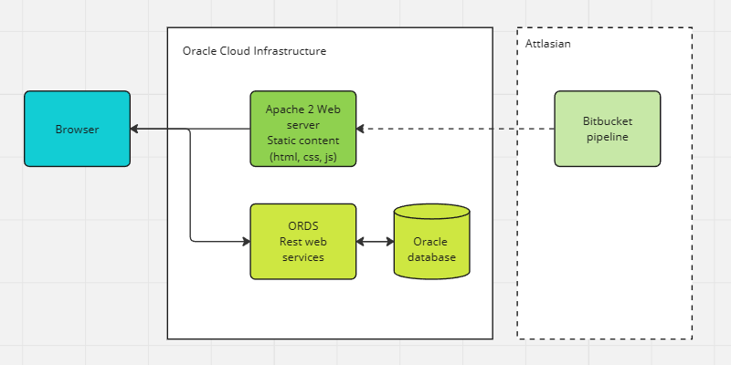

# Oracle Data Base for the Back End?

Using Oracle Database with Oracle REST Data Services (ORDS) for a backend has several advantages:

**Seamless Integration**: Since ORDS is developed by Oracle specifically for use with Oracle Database, it provides seamless integration with the database. This means you can easily expose your database objects (tables, views, PL/SQL procedures, etc.) as RESTful web services without much effort.

**Security**: Oracle Database has robust security features, and ORDS inherits these features. You can leverage Oracle's authentication and authorization mechanisms to ensure that only authorized users and applications can access your data through the REST APIs.

**Performance**: Oracle Database is known for its performance capabilities, and when used with ORDS, you can create efficient and optimized RESTful APIs. ORDS includes features like connection pooling and caching, which can enhance performance.

**Scalability**: Oracle Database is designed to handle high volumes of data and transactions. When your application experiences growth, Oracle Database can scale horizontally and vertically to meet the demands. ORDS can be deployed on multiple servers and load-balanced to distribute traffic effectively.

**Data Integrity**: Oracle Database enforces data integrity through constraints, triggers, and other mechanisms. When you use Oracle Database with ORDS, you can ensure that data accessed and modified through the REST API adheres to your defined business rules and data integrity constraints.

**Developer-Friendly**: ORDS simplifies the process of creating RESTful APIs for developers. It provides tools and utilities that make it easier to expose database functionality as web services. Developers can focus on writing business logic rather than dealing with low-level HTTP request handling.

**Support and Documentation**: Oracle provides extensive documentation and support for Oracle Database and ORDS. This means you can find resources, tutorials, and assistance when developing and maintaining your backend infrastructure.

So, what are the cons?

**Cost**: Oracle products, including Oracle Database, can be expensive. Licensing, support, and maintenance costs can be substantial, which might not be feasible for small startups or projects with tight budgets. Alternative databases and backend solutions may be more cost-effective.

**Overhead**: Oracle Database is a powerful, enterprise-grade relational database management system. If your project doesn't require the full range of features and capabilities it offers, using Oracle Database may introduce unnecessary complexity and overhead.

**Complexity**: Oracle Database is known for its complexity, especially for those who are not experienced with Oracle technology. Managing and configuring the database can be challenging, and it might be overkill for simpler projects that could be adequately served by less complex databases.

## Free Tier

[Oracle Cloud Free Tier](https://www.oracle.com/cloud/free/) provides an opportunity to build, test, and deploy applications on Oracle Cloud - for free. Forever.

This is the reason why this tutorial will show how to build a fully functional solution in Oracle Cloud Infrastructure.

## Setting up an account

1. Set up an account in [Oracle Cloud Free Tier](https://signup.oraclecloud.com/).

2. [Create an Always Free Autonomous Database on the Oracle Cloud](https://learncodeshare.net/2020/01/09/create-an-always-free-autonomous-database-on-the-oracle-cloud/) and download Wallet for connection to the Oracle database.

3. Download wallet and enable ADMIN connection from SQL Developer for VSCode.

## Some explanation

Typically, any serious information system would consist of several layers, several domains - user interface, business logic, database, identity services and so on. In our case, we will have all necessary logic in database routines [PL\SQL](https://www.oracle.com/database/technologies/appdev/plsql.html), so solution architecture is like this:

The magic part of our solution will be that we will automatically expose our PL\SQL package routines as Oracle Rest Data Services, therefore all programming work will be to write the necessary data base queries.

Check [odb4bb](https://github.com/erlihs/odb4bb)

## Zero application layer?

As idea of keeping business logic in database routines and having no application layer might seem odd, let's see what Large Language Model thinks.

> Using PL/SQL for business logic can be a good idea, but it depends on several factors. Here are some points to consider:
>
> ### Advantages of Using PL/SQL for Business Logic:
>
> 1. **Performance**: PL/SQL is processed by the Oracle Database, which can lead to faster execution compared to application server processing, especially for data-intensive operations.
> 2. **Data Integrity**: By encapsulating business logic in the database, you can enforce data integrity and business rules directly where the data resides.
> 3. **Centralization**: Having business logic in PL/SQL centralizes the logic in the database, making it easier to manage and maintain, especially in environments with multiple applications accessing the same database.
> 4. **Reduced Network Traffic**: Since operations are done in the database, there's less need to transfer data back and forth between the application server and the database, which can improve performance for certain types of applications.
>
> ### Disadvantages:
>
> 1. **Tight Coupling with Database**: Business logic in PL/SQL ties your application closely to Oracle Database, which can limit flexibility and make it harder to switch databases or use multiple databases.
> 2. **Skill Set Requirements**: Writing and maintaining PL/SQL requires specialized knowledge, which might not be as widely available as skills for other programming languages.
> 3. **Scalability and Load Balancing**: Scaling an application that relies heavily on database-stored procedures can be more challenging compared to an application with logic in the application layer, where load balancing and scaling can be more straightforward.
> 4. **Testing and Debugging**: Testing PL/SQL business logic can be more challenging compared to testing code in a traditional application layer. This can affect the overall development and maintenance cycle.
>
> ### Best Practices:
>
> 1. **Use for Data-Intensive Operations**: PL/SQL is best suited for operations that are heavily data-oriented, like complex queries, data aggregation, and batch processing.
> 2. **Avoid for Application-Specific Logic**: Business rules that are specific to an application and not to the data itself are generally better placed in the application layer.
> 3. **Document and Manage**: Ensure that your PL/SQL code is well-documented and managed under version control, just like application code.
>
> ### Conclusion:
>
> Whether or not it is a good idea to put business logic in PL/SQL depends on your specific application requirements, the complexity of your business rules, your team's expertise, and the architecture of your system. In some cases, a hybrid approach, where critical data-intensive operations are handled in PL/SQL and more general application logic is handled in the application layer, might be the best solution.

[Check some Best Practices](https://blog.cloudnueva.com/ords-plsql-based-rest-api-bp)
