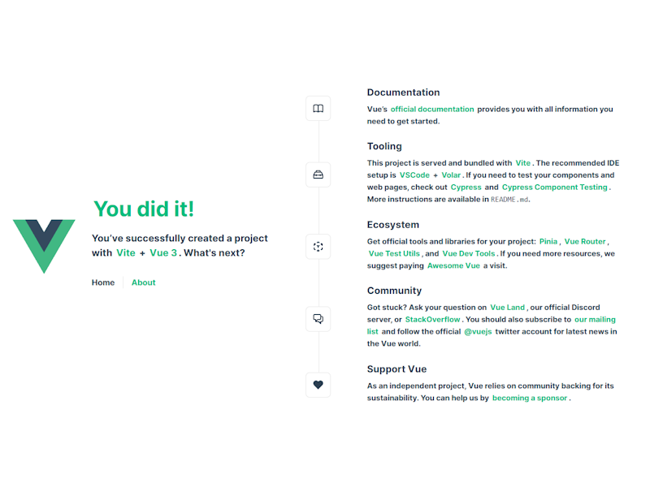

# Install Vue 3 + Vite + Typescript

## Create the new app

[Vue.js](https://vuejs.org/) comes with prebuilt tooling making creation of the new app smooth and saving a lot of time.

1. From the root directory of the project, run:

```ps
npm create vue@latest
```

and follow the wizard. Here are the recommended selections:

```
✔ Project name: … apps
✔ Add TypeScript? … Yes
✔ Add JSX Support? … No
✔ Add Vue Router for Single Page Application development? … Yes
✔ Add Pinia for state management? … Yes
✔ Add Vitest for Unit testing? … Yes
✔ Add an End-to-End Testing Solution? … Cypress
✔ Add ESLint for code quality? … Yes
✔ Add Prettier for code formatting? … Yes
```

2. Run the project

```ps
cd apps
npm install
npm format
npm run dev
```

3. You will now be able to open your application in a browser. Follow instructions in a terminal.



## What is included?

As mentioned, Vue.js comes with a number of selections, many of which will be improved and extended in the app. Here is a brief summary.

### TypeScript

[TypeScript](https://www.typescriptlang.org/) is a strongly typed programming language that builds on JavaScript, giving you better tooling at any scale.

### Vue Router

[Vue Router](https://router.vuejs.org/) provides expressive, configurable and convenient routing capabilities for the application.

### Pinia

[Pinia](https://pinia.vuejs.org/) provides state management for Vue.js enabling the creation of large and complex applications.

### Vitest

[Vitest](https://vitest.dev/) is a test framework for writing unit tests and component tests.

```ps
npm run test:unit
```

### Cypress

[Cypress](https://www.cypress.io/) is a framework for writing end-to-end tests.

```ps
npm run test:e2e:dev
```

### ESLint

[ESLint](https://eslint.org/) is a static code analyzer that identifies potential problems in code.

```ps
npm run lint
```

### Prettier

[Prettier](https://prettier.io/) is a code formatter that ensures that code is consistently written throughout the project.

```ps
npm run format
```

### File path alias

In addition, the app is pre-configured with a file path alias for files in `./src` to avoid writing constructions like `../../include`. Instead, we can use a file path alias for the source directory and write `@/modules/my_module/include`, where `@` represents the `./src` directory.
