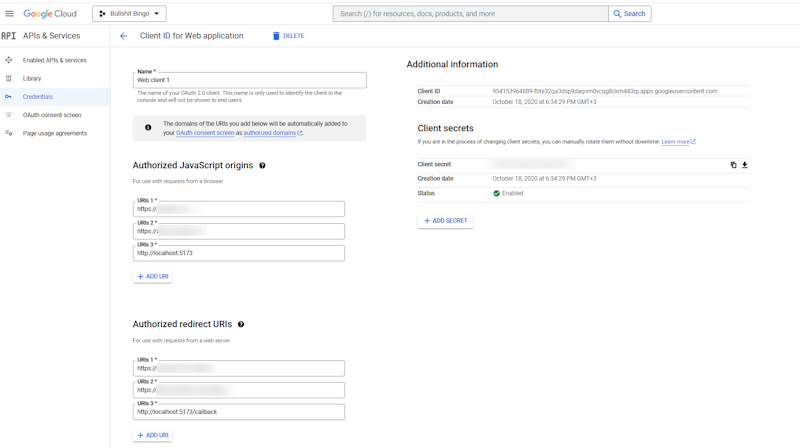

# Social sign up

1. Create Google OAuth 2.0 Client IDs

Create [Google credentials](https://console.cloud.google.com/apis/credentials)



Add uri for your site `https://yourdomain.com` and callback `https://yourdomain.com/callback` as well as for development `http://localhost:5173` and callback `http://localhost:5173/callback`.

2. Install vue3 login plugin

```ps
npm install vue3-google-login
```

3. Add key to environment variables `.env.production` and `.env.development.local`

```ini
VITE_GOOGLE_CLIENT_ID = ********-********.apps.googleusercontent.com
```

4. Add to store `@/store/app/auth.ts`

```ts
...
    async function signupSocial(username: string, password: string, fullname: string): Promise<boolean> {
      startLoading()
      const logged = await login(username, password)
      if (!logged) await signup(username, password, fullname)
      stopLoading()
      return isAuthenticated.value
    }
...

```

5. Add to login form

```vue{13,21-22}
<template>
  <v-container>
    <v-row justify="center">
      <v-col cols="12" :md="4">
        <h1 class="mb-4">{{ t('login') }}</h1>
        <v-bsb-form :options :data @submit="submit" @action="dev" />
        <br />
        <br />
        {{ t('not.registered.yet') }} <a href="/signup">{{ t('sign.up') }}</a> |
        <a href="/recover-password">{{ t('forgot.password') }}</a>
        <br />
        <br />
        <GoogleLogin :clientId="googleClientId" :callback="callback" />
      </v-col>
    </v-row>
  </v-container>
</template>

<script setup lang="ts">
// ...
import { GoogleLogin } from 'vue3-google-login';
const googleClientId = import.meta.env.VITE_GOOGLE_CLIENT_ID;
// ...
</script>
```
