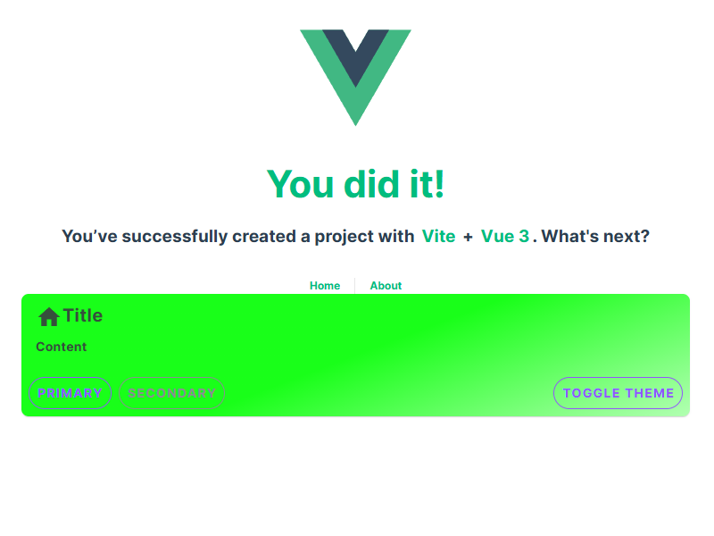

# UI Component Framework

## Why Vuetify?

There are number of UI frameworks for Vue out there. Check this [comparison](https://blog.logrocket.com/best-ui-frameworks-vue-3/). [Vuetify](https://vuetifyjs.com/) is often considered one of the best UI component frameworks for Vue.js due to **Material design**, **Rich Component Library** and by design **Responsive Design**.

## Add Vuetify to the project

1. Install [Vuetify](https://vuetifyjs.com/) Component Framework

```ps
npm install vuetify
npm install -D vite-plugin-vuetify
```

2.  Add Vuetify Plugin to Vite configuration `/vite.config.ts` to enable Hot Module Reloading for Vuetify components.

```ts
// ...
import Vuetify from 'vite-plugin-vuetify'

export default defineConfig({
  plugins: [
    // ...
    Vuetify(),
  ],
  // ...
})
```

3. Create new file `@/plugins/vuetify.ts` with Vuetify configuration.

```ts
import 'vuetify/styles'
import { createVuetify } from 'vuetify'

export default createVuetify({})
```

4. Modify `@/main.ts` to use Vuetify

```ts{2,7}
// ...
import vuetify from './plugins/vuetify'

const app = createApp(App)

// ...
app.use(vuetify)

app.mount('#app')
```

5. Create new test page `@/pages/sandbox/index.vue` and open `http://localhost:5173/sandbox` to see Vuetify UI Components in action.

```vue
<template>
  <v-card>
    <v-card-title>Title</v-card-title>
    <v-card-text>Content</v-card-text>
    <v-card-actions>
      <v-btn color="primary">Primary</v-btn>
      <v-btn color="secondary">Secondary</v-btn>
    </v-card-actions>
  </v-card>
</template>
```

## Blueprints

[Blueprints](https://vuetifyjs.com/en/features/blueprints/) is a collection of pre-defined Material design defaults. Choose the blueprint and add in `@/plugins/vuetify.ts`

```ts
// ...
import { md3 } from 'vuetify/blueprints'
// ...
export default createVuetify({
  // ...
  blueprint: md3,
})
```

## Themes

[Theme](https://vuetifyjs.com/en/features/theme/) allows to create different themes for your application.

1. Create light and dark themes.

::: details `@/themes/light.ts`
<<< ../../../src/themes/light.ts
:::

::: details `@/themes/dark.ts`
<<< ../../../src/themes/dark.ts
:::

2. Import and add customized color schemes for light and dark themes in `@/plugins/vuetify.ts`.

```ts{2,3,7-13}
// ...
import light from '@/themes/light'
import dark from '@/themes/dark'
// ...
export default createVuetify({
// ...
  theme: {
    defaultTheme: 'light',
    themes: {
      light,
      dark,
    },
  },
//...
})
```

3. Add theme toggling to `@\pages\sandbox\index.vue` and check how it works.

```vue
<template>
  <v-card>
    <v-card-title>Title</v-card-title>
    <v-card-text>Content</v-card-text>
    <v-card-actions>
      <v-btn color="primary">Primary</v-btn>
      <v-btn color="secondary">Secondary</v-btn>
      <v-spacer></v-spacer>
      <v-btn @click="toggleTheme">Toggle theme</v-btn>
    </v-card-actions>
  </v-card>
</template>

<script setup lang="ts">
import { useTheme } from 'vuetify'

const theme = useTheme()

function toggleTheme() {
  theme.global.name.value = theme.global.current.value.dark ? 'light' : 'dark'
}
</script>
```

## Global configuration

[Global configuration](https://vuetifyjs.com/en/features/global-configuration/) is one of the most powerful features allowing you to set default prop values globally or per component when setting up your application. As an example, to make all card action buttons outlined globally:

1. Create file `@/themes/defaults.ts`

```ts
export default {
  VCardActions: {
    VBtn: { variant: 'outlined' },
    class: 'd-flex flex-wrap',
  },
}
```

2. Import defaults in `@/plugins/vuetify.ts`

```ts
// ...
import defaults from '@/themes/defaults'
// ...
export default createVuetify({
  // ...
  defaults,
  // ...
})
```

## Icons

To keep bundled size low, it is important to include only icons that are used in the project.

1. Install icon library

```ps
npm install @mdi/js

```

2. Create file of used icons `@/themes/icons.ts`

```ts
import { mdiHome } from '@mdi/js'
export default { mdiHome }
```

3. Imports icons into `@/plugins/vuetify.ts`

```ts
// ...
import { aliases, mdi } from 'vuetify/iconsets/mdi-svg'
import icons from '@/themes/icons'
// ...
export default createVuetify({
  //...
  icons: {
    defaultSet: 'mdi',
    aliases: {
      ...aliases,
      ...icons,
    },
    sets: {
      mdi,
    },
  },
  //...
})
```

4. Add icon to `@/pages/sandbox.vue`

```vue
...
<v-card-title><v-icon icon="$mdiHome" />Title</v-card-title>
...
```

## Cherries

It is always nice to add some small nuance that differentiates your app from others. Here is an example to provide customized background style.

1. Create a new composable `@\composables\ui.ts` for enhanced UI features

```ts
export function useCardBackground(color?: string) {
  return {
    background: color ? `linear-gradient(135deg, ${color}DD 0%, ${color}33 100%)` : undefined,
  }
}
```

2. Add custom card background to `@/pages/sandbox.vue`

```vue
<template>
  <v-card :style="useCardBackground('#00FF00')">
    <!-- ... -->
  </v-card>
</template>

<script setup lang="ts">
// ...
import { useCardBackground } from '@/composables/ui'
// ...
</script>
```

This function will provide possibility to dynamically adjust object backgrounds.



## Custom components

Although each page in Vue is typically a UI component, it is crucial to distinguish between pages, modules specific components and generic, universal, reusable components.

Recommendation is to keep number of components low and rely as much as possible on framework. Vuetify offers vast majority of needed ready to use [components](https://vuetifyjs.com/en/components/all/). However, custom components are justifiable to create really beneficial and reusable super-features of the app where framework does not provide ones.

Check the [Advanced UI Components](./advanced-ui-components/) section.
