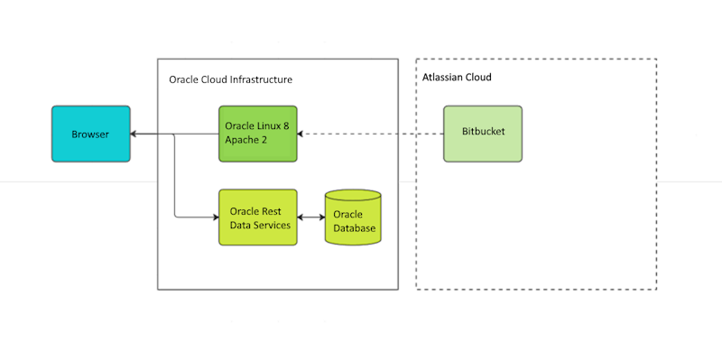

# Architecture

Our web application setup will use Vue for the front-end and Oracle Database with Oracle REST Data Services for the back-end.

## Web application architecture

Choosing between Single-Page Applications (SPA), Server-Side Rendering (SSR), and Static Site Generation (SSG) depends on various factors. These factors include the project requirements, desired user experience, development team's expertise, performance considerations, and scalability needs.

[Web Application Architecture in 2023](https://mobidev.biz/blog/web-application-architecture-types)

1. **SPA (Single-Page Application)**:

   - Use SPA when:
     - You want to build highly interactive and responsive web applications that provide a desktop-like experience.
     - Your application requires frequent updates or real-time data synchronization.
     - You have a team skilled in frontend JavaScript frameworks like React, Angular, or Vue.js.
   - Benefits:
     - Rich and interactive user experience with smooth page transitions.
     - Improved performance after the initial page load since subsequent data fetching happens asynchronously.
     - Better code modularity and reusability due to the frontend framework's component-based architecture.
   - Considerations:
     - Initial page load might be slower compared to SSR or SSG due to the need to download the entire JavaScript bundle.
     - SEO might be a concern since search engine crawlers may have difficulty indexing dynamically rendered content.

2. **SSR (Server-Side Rendering)**:

   - Use SSR when:
     - You prioritize search engine optimization and want search engines to easily crawl and index your content.
     - Your application needs to display different content based on user authentication, personalized data, or time-sensitive information.
     - You have a team experienced in server-side programming languages like Node.js, Python, or Ruby.
   - Benefits:
     - Improved initial page load time and perceived performance since the server renders the HTML with data before sending it to the client.
     - Better SEO as search engine crawlers can easily access the pre-rendered content.
     - Easier integration with third-party APIs and services that rely on server-side logic.
   - Considerations:
     - More server-side processing and increased server load due to rendering HTML on each request.
     - Complex client-state management and interactivity require additional JavaScript and AJAX calls.

3. **SSG (Static Site Generation)**:
   - Use SSG when:
     - Your content doesn't require real-time data updates or user-specific content.
     - You want improved performance, security, and cost-efficiency.
     - You have a team skilled in frontend technologies and static site generators like Gatsby, Next.js, or Jekyll.
   - Benefits:
     - Fast and efficient loading times as the HTML pages are pre-rendered during build time and served as static files.
     - Enhanced security due to reduced server-side processing and attack surface.
     - Easy scalability and reduced server costs as the static files can be served through content delivery networks (CDNs).
   - Considerations:
     - Dynamic content updates require a build and deployment process to regenerate the static files.
     - Real-time user interactions or personalized content might require additional client-side JavaScript or API calls.

## Back-end architecture

[Oracle Rest Data Services](https://www.oracle.com/database/technologies/appdev/rest.html)

Oracle Database with Oracle REST Data Services is a good choice for a web application's back end due to several reasons:

1. Robust and Reliable: Oracle Database is a highly reliable and robust database management system used by many organizations worldwide. It has been in the market for several decades and has a proven track record of performance and stability. This reliability extends to the web application's back end, ensuring that the data is securely stored and accessible.

2. Scalability: Oracle Database is designed to handle large-scale applications with high volumes of data and concurrent users. It offers features like partitioning, clustering, and parallel processing, which allow the database to scale as the application grows. This scalability is crucial for web applications that need to handle increasing user loads and data volumes.

3. Advanced Data Management: Oracle Database provides a comprehensive set of data management capabilities. It supports complex queries, indexing, and data integrity constraints, enabling efficient data retrieval and manipulation. With its support for transactions and ACID (Atomicity, Consistency, Isolation, Durability) properties, Oracle ensures data integrity and consistency, even in high-concurrency environments.

4. SQL and PL/SQL Support: Oracle Database uses SQL (Structured Query Language) as its primary query language. SQL is a widely adopted standard, and developers with SQL skills can easily work with Oracle Database. Additionally, Oracle Database also supports PL/SQL, which is Oracle's procedural language extension. PL/SQL allows developers to create stored procedures, functions and triggers directly in the database, providing better performance and security.

5. Security: Oracle Database offers robust security features to protect data. It supports fine-grained access control, encryption, auditing, and data masking. These security mechanisms help ensure that sensitive data is protected, and only authorized users can access and modify it. This is crucial for web applications that handle sensitive user information or confidential business data.

6. Oracle REST Data Services (ORDS): ORDS is a feature of Oracle Database that enables developers to expose SQL and PL/SQL functionality through RESTful web services. ORDS simplifies the process of building REST APIs for Oracle Database, allowing developers to quickly create web services to access and manipulate data. It provides authentication, authorization, and parameter validation mechanisms, making it easier to build secure and scalable web applications.

Overall, the combination of Oracle Database with ORDS provides a powerful and reliable back-end solution for web applications. It offers scalability, robust data management, security features, integration capabilities, and ease of development through RESTful APIs, making it a compelling choice for building enterprise-grade web applications.

## Zero application layer?

The idea of keeping business logic in database routines and having no application layer might seem odd, so here is an independent opinion.

> Using PL/SQL for business logic can be a good idea, but it depends on several factors. Here are some points to consider:
>
> ### Advantages of Using PL/SQL for Business Logic:
>
> 1. **Performance**: PL/SQL is processed by the Oracle Database, which can lead to faster execution compared to application server processing, especially for data-intensive operations.
> 2. **Data Integrity**: By encapsulating business logic in the database, you can enforce data integrity and business rules directly where the data resides.
> 3. **Centralization**: Having business logic in PL/SQL centralizes the logic in the database, making it easier to manage and maintain, especially in environments with multiple applications accessing the same database.
> 4. **Reduced Network Traffic**: Since operations are done in the database, there's less need to transfer data back and forth between the application server and the database, which can improve performance for certain types of applications.
>
> ### Disadvantages:
>
> 1. **Tight Coupling with Database**: Business logic in PL/SQL ties your application closely to Oracle Database, which can limit flexibility and make it harder to switch databases or use multiple databases.
> 2. **Skill Set Requirements**: Writing and maintaining PL/SQL requires specialized knowledge, which might not be as widely available as skills for other programming languages.
> 3. **Scalability and Load Balancing**: Scaling an application that relies heavily on database-stored procedures can be more challenging compared to an application with logic in the application layer, where load balancing and scaling can be more straightforward.
> 4. **Testing and Debugging**: Testing PL/SQL business logic can be more challenging compared to testing code in a traditional application layer. This can affect the overall development and maintenance cycle.
>
> ### Best Practices:
>
> 1. **Use for Data-Intensive Operations**: PL/SQL is best suited for operations that are heavily data-oriented, like complex queries, data aggregation, and batch processing.
> 2. **Avoid for Application-Specific Logic**: Business rules that are specific to an application and not to the data itself are generally better placed in the application layer.
> 3. **Document and Manage**: Ensure that your PL/SQL code is well-documented and managed under version control, just like application code.
>
> ### Conclusion:
>
> Whether or not it is a good idea to put business logic in PL/SQL depends on your specific application requirements, the complexity of your business rules, your team's expertise, and the architecture of your system. In some cases, a hybrid approach, where critical data-intensive operations are handled in PL/SQL and more general application logic is handled in the application layer, might be the best solution.

## Takeaway

The selected architecture is fast and relatively simple, allowing for quick market entry. It will easily scale up to tens of thousands of end users, covering relatively complex business scenarios and providing fast and smooth end user experience.

However, scaling beyond this point will require additional measures and may incur certain licensing costs.
