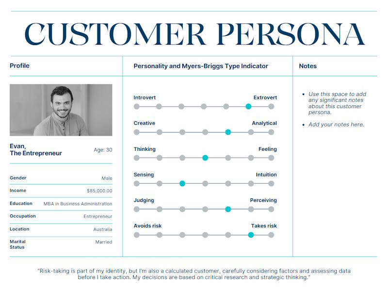
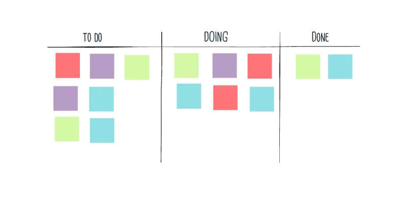

# Habits

Designing and building a web application requires not only technical skills but also certain habits and practices that contribute to a successful development process. Here are some essential habits to cultivate when designing and building a web application. By adopting these habits, you'll not only improve the design and development process of your web application but also set a foundation for creating high-quality, user-centric, and maintainable software.

## Continuous Learning and Adaptability

The field of web development is constantly evolving, so it's important to cultivate a habit of continuous learning. Stay updated with the latest trends, technologies, and best practices. Be open to adopting new tools and frameworks that can enhance your development process. Regularly participate in online communities, attend conferences or webinars, and explore new resources to expand your knowledge.

## User-Centric Approach

Always prioritize the needs and expectations of your target users. Conduct user research, create user personas, and gather feedback to understand their requirements. Design and develop your web application with a focus on delivering an intuitive, user-friendly experience.

## Iterations and frequent feedback loops

Break down the development process into manageable tasks and create a roadmap to guide your progress. Use project management tools or techniques like Agile methodologies to stay organized and track your progress effectively.

Gather feedback after each iteration as frequent feedback loops support continuous improvement, enable timely adjustments, enhance motivation, and ensure customer satisfaction.

## Timeboxing

Timeboxing is an effective technique for managing time, enhancing productivity, and achieving a better work-life balance. It provides structure, improves focus, and helps individuals make the most of their available time.

